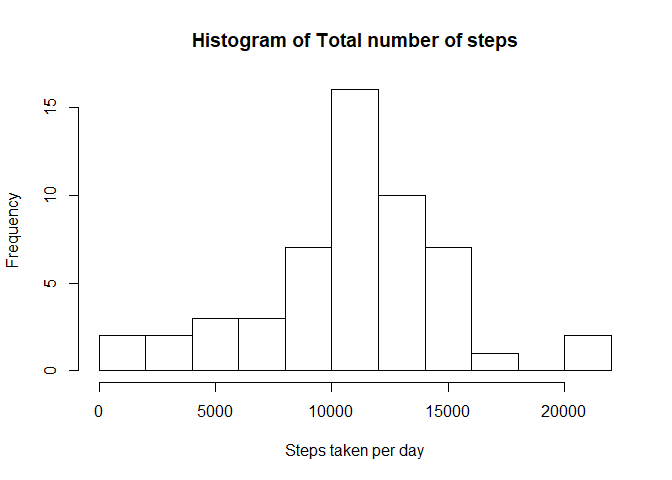
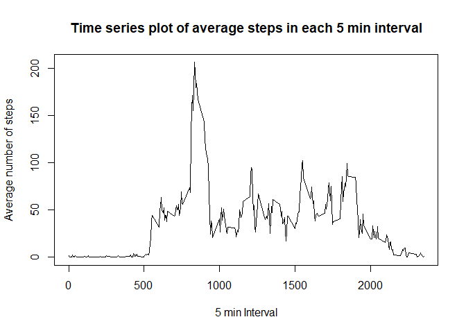
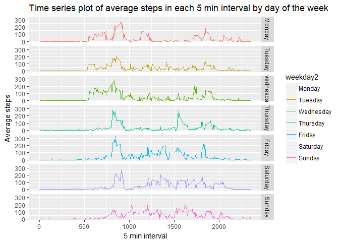
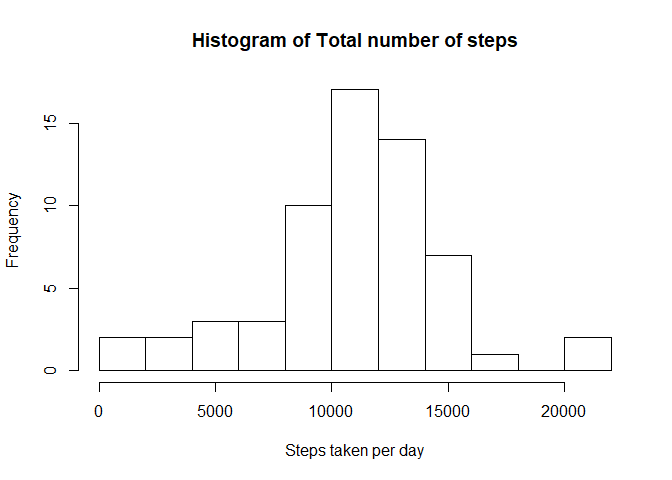
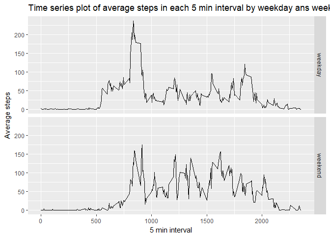

# Reproducible Research: Peer Assessment 1


## Loading and preprocessing the data

First the data wil be unzipped if it has not already been unzipped. This can stil be improved much currently it depends on knowing the contents of the *.zip* file and the name of the *.zip* file its self further generlization is posible. 


```r
knitr::opts_chunk$set(echo = TRUE)

if(!("activity" %in% dir())){
    unzip(zipfile = "activity.zip"
      ,list = 
      ,exdir = "activity")
}else if(!("activity.csv" %in% dir("activity"))){
    unzip(zipfile = "activity.zip"
      ,list = 
      ,exdir = "activity")
}
```


Then the data wil then be loaded. The headers are included in the file strings are in *\'* **\"** *\'* (quotation marks).The values are seperated by *\'* **,** *\'* (commas).And the missing Values are denoted by *\'* **NA** *\'*.The dates are read in as character variables, they are then converted into date formats.


```r
data1=read.csv(file = "activity/activity.csv"
               ,header = TRUE
               ,sep = ","
               ,quote = '"'
               ,stringsAsFactors = FALSE
               ,na.strings = "NA")
data1$date2=as.Date(x = data1$date)

head(data1)
```

```
##   steps       date interval      date2
## 1    NA 2012-10-01        0 2012-10-01
## 2    NA 2012-10-01        5 2012-10-01
## 3    NA 2012-10-01       10 2012-10-01
## 4    NA 2012-10-01       15 2012-10-01
## 5    NA 2012-10-01       20 2012-10-01
## 6    NA 2012-10-01       25 2012-10-01
```

```r
str(data1)
```

```
## 'data.frame':	17568 obs. of  4 variables:
##  $ steps   : int  NA NA NA NA NA NA NA NA NA NA ...
##  $ date    : chr  "2012-10-01" "2012-10-01" "2012-10-01" "2012-10-01" ...
##  $ interval: int  0 5 10 15 20 25 30 35 40 45 ...
##  $ date2   : Date, format: "2012-10-01" "2012-10-01" ...
```

```r
summary(data1)
```

```
##      steps            date              interval          date2           
##  Min.   :  0.00   Length:17568       Min.   :   0.0   Min.   :2012-10-01  
##  1st Qu.:  0.00   Class :character   1st Qu.: 588.8   1st Qu.:2012-10-16  
##  Median :  0.00   Mode  :character   Median :1177.5   Median :2012-10-31  
##  Mean   : 37.38                      Mean   :1177.5   Mean   :2012-10-31  
##  3rd Qu.: 12.00                      3rd Qu.:1766.2   3rd Qu.:2012-11-15  
##  Max.   :806.00                      Max.   :2355.0   Max.   :2012-11-30  
##  NA's   :2304
```


## What is mean total number of steps taken per day

First the missing values are removed from the data. Then the total number of steps is calculated for each day. A histogram is drawn of the total number of steps taken for each day. After this the mean and Median total number of steps is calculated.


```r
data2=data1[,!(names(data1) %in% c("date","interval"))]
data3=data2[!(is.na(data2$steps)),]
data4=aggregate(x=data3$steps
          ,by=list(date2=data3$date2)
          ,FUN=sum)
head(data4)
```

```
##        date2     x
## 1 2012-10-02   126
## 2 2012-10-03 11352
## 3 2012-10-04 12116
## 4 2012-10-05 13294
## 5 2012-10-06 15420
## 6 2012-10-07 11015
```

```r
hist(x = data4$x
     ,breaks = 10
     ,main = "Histogram of Total number of steps"
     ,xlab = "Steps taken per day")
```

<!-- -->

```r
Mean_Total1=mean(data4$x)
Mean_Total1
```

```
## [1] 10766.19
```

```r
Median_Total1=median(data4$x)
Median_Total1
```

```
## [1] 10765
```

```r
rm(data2
   ,data3
   ,data4)
```

The average total number of steps taken per day is: 10766.19.  
The median number of steps taken per day is: 10765.   


## What is the average daily activity pattern?

The missing values are again removed. The average number of steps for each interval is calculated. A time series is drawn for the average number of steps in each interval. The interval containing the maximum average number of steps is then also detirmend.


```r
data2=data1[,!(names(data1) %in% c("date","date2"))]
data3=data2[!(is.na(data2$steps)),]
data4=aggregate(x=data3$steps
          ,by=list(interval=data3$interval)
          ,FUN=mean)
head(data4)
```

```
##   interval         x
## 1        0 1.7169811
## 2        5 0.3396226
## 3       10 0.1320755
## 4       15 0.1509434
## 5       20 0.0754717
## 6       25 2.0943396
```

```r
plot(x = data4$interval
     ,y = data4$x
     ,type = "l"
     ,main = "Time series plot of average steps in each 5 min interval"
     ,xlab = "5 min Interval"
     ,ylab = "Average number of steps")
```

<!-- -->

```r
max_steps=max(data4$x)
data5=data4[data4$x==max_steps,]
names(data5)=c("Interval","Steps")
data5
```

```
##     Interval    Steps
## 104      835 206.1698
```

```r
rm(data2,data3,data4,max_steps)
```

The 5 min interval(s) that contained the maximum is: 835 and the maximum is 206.17


## Imputing missing values

The Number of missing entries is calculated. For the missing values the average for each interval by day of the week is used. This is done because daily routines differ by day. The missing values is then replaced by by the means. New means and medians are then calculated.


```r
rm(data5)
number_of_missing=sum(is.na(data1$steps))

data1$weekday=as.factor(weekdays(data1$date2))

data2=data1[!(is.na(data1$steps)),]


data3=data1[(is.na(data1$steps)),]

data4=aggregate(x=data2$steps
                ,by=list(interval=data2$interval
                         ,weekday=data2$weekday)
                ,FUN=mean)
table(data4$weekday)
```

```
## 
##    Friday    Monday  Saturday    Sunday  Thursday   Tuesday Wednesday 
##       288       288       288       288       288       288       288
```

```r
data4$weekday2=factor(data4$weekday
                      ,levels = c("Monday","Tuesday"
                                  ,"Wednesday","Thursday"
                                  ,"Friday","Saturday","Sunday"))
library(ggplot2)
ggplot(data = data4
       ,mapping = aes(x = interval, y =x))+
  geom_line(mapping=aes(col=weekday2),
            show.legend = TRUE)+
        facet_grid(facets = weekday2~.)+
  labs(title="Time series plot of average steps in each 5 min interval by day of the week",
       x="5 min interval",
       y="Average steps")
```

<!-- -->

```r
data5=merge(x=data3
            ,y=data4
            ,by.x = c("weekday","interval")
            ,by.y = c("weekday","interval"))
data5$steps=data5$x
data5=data5[,!(names(data5) %in% c("x"))]
data2$weekday2=factor(data2$weekday
                      ,levels = c("Monday","Tuesday"
                                  ,"Wednesday","Thursday"
                                  ,"Friday","Saturday","Sunday"))

data6=rbind(data2,data5)


data7=aggregate(x=data6$steps
          ,by=list(date2=data6$date2)
          ,FUN=sum)

hist(x = data7$x
     ,breaks = 10
     ,main = "Histogram of Total number of steps"
     ,xlab = "Steps taken per day")
```

<!-- -->

```r
Mean_Total2=mean(data7$x)
Mean_Total2
```

```
## [1] 10821.21
```

```r
Median_Total2=median(data7$x)
Median_Total2
```

```
## [1] 11015
```

```r
rm(data2, data3, data4, data5, data7)
```

The number of mising values is 2304   

The average total number of steps taken per day without missing data is: 10766.19.  
The average number of steps with the imputed data is:10821.21.    
The median number of steps taken per day without missing data is: 10765.    
The median number of steps with the imputed data is: 11015.      

As can be seen imputting data incrases the average and median. The mediaan is increased more than the average. The median and average are also now further apart. Imputing thus does have an effect.


## Are there differences in activity patterns between weekdays and weekends?


```r
rm(number_of_missing)

data6$weekend=as.factor(ifelse(data6$weekday %in% c('Saturday','Sunday')
                               ,"weekend"
                               ,'weekday'))

data8=aggregate(x = data6$steps
                ,by =list(interval=data6$interval
                          ,weekend=data6$weekend)
                ,FUN = mean)

library(ggplot2)
ggplot(data = data8
       ,mapping = aes(x = interval, y =x))+
  geom_line()+
        facet_grid(facets = weekend~.)+
  labs(title="Time series plot of average steps in each 5 min interval by weekday ans weekends",
       x="5 min interval",
       y="Average steps")
```

<!-- -->

```r
table(data6$weekday,data6$weekend)
```

```
##            
##             weekday weekend
##   Friday       2592       0
##   Monday       2592       0
##   Saturday        0    2304
##   Sunday          0    2304
##   Thursday     2592       0
##   Tuesday      2592       0
##   Wednesday    2592       0
```

```r
rm(list=ls())
```

As can be seen from this plot there is a diffrent between weekdays and weekends most noticibly is that the steps start later on weekends.


